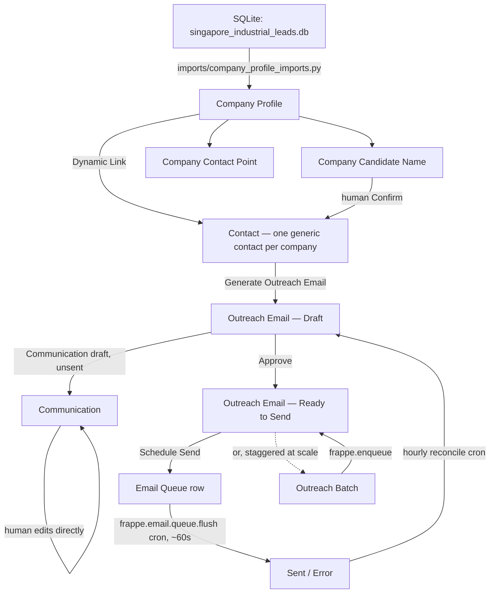

# Lead Outreach Manager

Turns verified Singapore industrial-zone leads (from the deterministic scraper pipeline at
[`lead-intelligence-pipeline`](https://github.com/phivinhkien1710-sudo/lead_intelligence)) into company
profiles, with a compliance-gated feature to generate an outreach email for a specific confirmed
contact, verify it, and schedule sending — built entirely on ERPNext's own email infrastructure.

## Architecture



## Core DocTypes

| DocType | Purpose |
|---|---|
| `Company Profile` | One record per usable lead (tier A: verified domain + found generic contact). Mirrors the source pipeline's fields; `contact_points` rebuilt wholesale each import, `candidate_names` merge-appended so confirmations survive re-import. `country` (Singapore/Vietnam) records which importer/pipeline a profile came from — see Importing leads below. |
| `Company Contact Point` | Child table — read-only mirror of the source `contact_points` rows. |
| `Company Candidate Name` | Child table — mirrors the source `candidate_names` rows plus the human confirmation gate (`confirmed`, `confirmed_by/_on`, linked `contact`), and the classification/verification results described below. |
| `Candidate Classification Run` | Tracks one batch pass of `services/candidate_classification.py` — the LLM-based person/not-person classification over unconfirmed candidate names. Status-tracked job doc, chunked, resumable. |
| `Email Verification Run` | Tracks one batch pass of `services/email_verification.py` — MillionVerifier-backed deliverability checks over a confirmed candidate's guessed emails. Same status-tracked/chunked/resumable pattern. |
| `Outreach Email` | One record per generate→verify→schedule cycle for a single contact. |
| `Outreach Batch` | Self-imposed rate-limited/staggered scheduling across many `Outreach Email` records at once. |
| `Outreach Generation Run` | Tracks one bulk pass of `services/outreach_generation.py` — generates an `Outreach Email` draft for every auto-confirmed candidate that doesn't have one yet. |
| `Outreach Settings` | Singleton — defaults (email template, sender account, rate limit, business hours) plus classification and verification configuration — see Outreach Settings below. |

Contact attachment uses core Frappe's own `Contact.links` (`Dynamic Link`) mechanism — the same one
Lead/Prospect/Customer already use — rather than a custom join doctype.

## Dependencies

`pyproject.toml` declares no third-party Python packages — the app runs on whatever's already in a
standard Frappe/ERPNext bench (Frappe itself only, via `bench`).

Two things are runtime dependencies but **not pip-installable**, since they're invoked as CLI
subprocesses rather than imported: the `claude` CLI (required for candidate-name classification,
`services/candidate_classification.py`) and optionally the `codex` CLI (fallback if `claude` fails).
Both are billed via whatever subscription is already logged into on the machine — not a metered API
key. `services.candidate_classification.discover_claude_cli`/`discover_codex_cli` auto-detect either
from `PATH` or from the VS Code Claude Code / ChatGPT extension's bundled binary; if neither is
reachable, classification runs will fail their CLI calls and abort after 3 consecutive failures
(chunk-boundary-safe, resumable — see Design Decisions below). Whichever machine runs the background
worker process needs one of these CLIs available, not just the machine running `bench`.

This is separate from — and doesn't contradict — the "no LLM call" design decision below, which is
specifically about the outreach **email generation** path (Jinja-only). Classification, a different
pipeline stage, does call an LLM.

`services/email_verification.py` similarly depends on a MillionVerifier account (pay-as-you-go, real
API key in Outreach Settings) — that one *is* a metered service, unlike the CLI subscriptions above.

## Scheduled Tasks

One cron, registered in `hooks.py`'s `scheduler_events`, runs hourly:
`lead_outreach_manager.tasks.hourly_reconcile_outreach_email_status` — reconciles each `Scheduled`
`Outreach Email`'s outcome against its `Email Queue` row (Sent/Failed), since Email Queue's own flush
cron sends asynchronously and never calls back into `Outreach Email` on its own. This depends on the
site's scheduler being enabled (`bench --site <site> scheduler enable`, or unpaused) — if it's off,
`Outreach Email` records will silently sit in `Scheduled` forever even after the underlying email
actually sends.

## Design Decisions

**Candidate names are never auto-trusted.** The source pipeline's `candidate_names` are a deliberately
unfiltered, regex-proximity-extracted bonus signal — even after an upstream cleanup pass, roughly
60-70% of them are scraped marketing copy rather than real people's names. Personalizing an outreach
email (setting a Contact's `first_name`/`last_name`/`designation`) only ever happens through an explicit
human "Confirm Name" action on a `Company Candidate Name` row — never automatically at import time.
Confirming a second name later simply re-personalizes the same Contact rather than creating a second
one, so there's never ambiguity about which of several possibly-confirmed names an email would use.

**Template-only email generation, deliberately no LLM call.** The source pipeline's whole design
philosophy is zero AI cost end-to-end; this app's email generation stays consistent with that by using
only Jinja mail-merge (`Email Template`) rendered against a Company Profile's own fields. Nothing in the
generate/approve/schedule path calls out to Claude or any other model.

**No custom mail infrastructure.** Generate → verify → schedule maps directly onto stock Frappe/ERPNext
primitives: `Communication` (an unsent draft *is* the verify step — a human edits it on its own standard
Desk form, nothing custom built for that), and `Email Queue` (`send_after` is the literal scheduling
field; the already-registered `frappe.email.queue.flush` cron, which runs every scheduler tick, sends
anything due — no new cron needed for the send-to-happen mechanic itself).

**Compliance safeguards built in from the start, not bolted on later.** Singapore's Spam Control Act /
PDPA governs unsolicited commercial email at this volume. `Company Profile.do_not_contact` and core
Contact's own `unsubscribed` field are checked at every stage (generate, approve, and again at schedule
time, since state can drift between steps) rather than only at the point of generation. `Outreach Batch`
exists specifically because Email Queue itself has no per-hour send cap — the rate limit is entirely
self-imposed, enforced by how far apart each targeted email's own `send_after` is set.

**Pipeline status fields are plain Data, not Select.** `domain_status`/`crawl_status`/`contact_status`/
`pipeline_stage` vocabularies are owned by the external Python scraper pipeline and could add new values
independently of this app. A `Select` field would silently start rejecting values the day the source
pipeline adds one; a read-only `Data` field with `search_index: 1` stays filterable without that
coupling.

**Only usable leads are imported, for now.** The importer intentionally does not import the ~57K
companies still awaiting domain/crawl processing in the source pipeline — only the tier-A "usable"
set (verified domain + a found generic contact). It's safe and idempotent to re-run
(`bench execute lead_outreach_manager.imports.company_profile_imports.import_usable_leads`) as the
source pipeline's background batch job promotes more companies to usable over time.

**Business logic lives in `services/`, not in doctype controllers.** Doctype `.py` controllers stay
thin — `validate()` hooks plus `@frappe.whitelist()` wrappers that delegate to `services/`. This keeps
the pure, DB-independent logic (contact-point preference ordering, staggered-scheduling math, Jinja
rendering) directly unit-testable without a Frappe site, and mirrors this bench's existing
`receivable_risk_manager` app's own established convention.

## Installing from scratch, if you don't already have a Frappe bench

This is for someone starting with nothing but this GitHub repo — no server, no Frappe bench, not
much technical background. It uses Frappe's own official one-command Docker installer, which builds
and starts everything (database, background workers, the app itself) without you needing to install
Python, Node, MariaDB, or Redis by hand. If you already have a Frappe bench running, skip to
[Setup](#setup) below instead — this section is the "build the bench itself" step before that.

**Honest expectations first:** this still means using a terminal and typing/copy-pasting commands —
there's no click-to-install version. Budget 30–60 minutes (most of it waiting, not typing), a computer
you're allowed to install software on (a locked-down work laptop often won't let you), and a few GB of
free disk space.

**1. Install Docker**, if you don't have it already.
- **Mac**: install [Docker Desktop](https://www.docker.com/products/docker-desktop/), open it once so
  it's running, then continue.
- **Linux (Ubuntu/Debian)**: the installer script below can install Docker for you automatically — skip
  this step.
- **Windows**: install [WSL2](https://learn.microsoft.com/windows/wsl/install) first, then Docker
  Desktop with WSL2 integration enabled. This path has more moving parts than Mac/Linux — if you get
  stuck, that's the point to hand this off to someone technical rather than push through alone.

**2. Open a terminal.** Mac: press `Cmd+Space`, type `Terminal`, hit Enter. Ubuntu: `Ctrl+Alt+T`.

**3. Download Frappe's installer script:**
```bash
curl -O https://raw.githubusercontent.com/frappe/bench/develop/easy-install.py
```

**4. In the same folder, create a file named `apps.json`** (any plain text editor works) with exactly
this content — it just tells the installer where to get this app's code:
```json
[
  {
    "url": "https://github.com/phivinhkien1710-sudo/lead-outreach-manager",
    "branch": "develop"
  }
]
```

**5. Run the installer.** This one command downloads Frappe, builds this app into it, creates a site,
and starts everything — it's the slow step (10–20 minutes):
```bash
python3 easy-install.py build \
  --project lead-outreach \
  --apps-json apps.json \
  --app lead_outreach_manager \
  --sitename lead-outreach.local \
  --no-ssl \
  --http-port 8080 \
  --email you@example.com \
  --deploy
```
What each part means: `--apps-json`/`--app` — this app's code, from step 4. `--sitename` — the site's
internal name, can stay as-is or be anything you like. `--no-ssl --http-port 8080` — serves plain
`http://` on port 8080 rather than needing a real domain and HTTPS certificate (fine for trying this
out; a real deployment with a domain is a separate, more advanced step — see `docs/DEPLOYMENT.md`).
`--email` — only used for HTTPS certificate renewal notices; put a real address you check, or leave
the default if using `--no-ssl`. `--deploy` — start it up once the build finishes.

**6. Find the generated password.** The script saves a random Administrator password to
`~/passwords.txt` on your computer — open that file to find it.

**7. Open your browser to `http://localhost:8080`** and log in as `Administrator` with that password.

**If it fails partway through**: the script logs everything to `~/easy-install.log` — that file is
what a technical person will want to see if you need to ask for help. This is a real installer doing
real work, not a guaranteed-to-succeed wizard; failures are more likely on unusual machines (very low
RAM/disk, restrictive corporate security software) than on a normal personal computer.

Once it's running, continue with the configuration steps below (Email Account, Email Template,
Outreach Settings) — then see `docs/USER_GUIDE.md` for how to actually use the app day to day.

## Setup

*(If you just finished "Installing from scratch" above, the app is already installed — skip straight
to the numbered configuration steps below. This section is for someone who already has a Frappe bench
and just needs to add this app to it.)*

```bash
cd /Users/phikien/erpnext/frappe-bench
bench --site lead-outreach.local install-app lead_outreach_manager
```

Then, on `lead-outreach.local`:
1. Configure an outgoing **Email Account** (`enable_outgoing=1`) — a real precondition, not something
   this app builds.
2. Create at least one **Email Template** for outreach content.
3. Fill in **Outreach Settings** — see the full field list below. `default_email_template` and
   `default_sender_email_account` are the only two anything downstream actually reads; everything
   else has a working default.

### Outreach Settings, in full

**Defaults**: `default_email_template`, `default_sender_email_account`, `default_rate_limit_per_hour`
(20), `default_business_hours_only` (on), `default_business_hours_start`/`_end` (9–18).

**Candidate Name Classification**: `auto_classify_after_import` (**off** — classification is manual
via `services.candidate_classification.enqueue_backfill` unless turned on), `classification_model`
(`haiku`), `classification_chunk_size` (50), `classification_cli_timeout` (120s),
`classification_cli_path`/`classification_fallback_cli_path`/`classification_fallback_model` (blank —
auto-detects `claude`/`codex`, see Dependencies), `classification_min_confirm_confidence` (0.85),
`classification_min_reject_confidence` (0.80), `recurrence_blacklist_threshold` (3 — names appearing on
this many distinct profiles are auto-rejected as boilerplate).

**Email Verification**: `auto_verify_after_classification` (**off**, same manual-unless-enabled
pattern), `email_verification_api_key` (a real MillionVerifier key — https://app.millionverifier.com,
pay-as-you-go, credits never expire but do need topping up), `email_verification_timeout` (20s),
`email_verification_chunk_size` (50 — up to 6 API calls per row, `guessed_email_1`–`6`).

## Importing leads

Two importers, one per source region, both idempotent (safe to re-run — each only adds what's new):

```bash
# Singapore — reads the normalized companies/contact_points/candidate_names schema
bench execute lead_outreach_manager.imports.company_profile_imports.import_usable_leads --kwargs "{'limit': 50}"

# Vietnam — reads the flat `leads` table schema, only rows with both a domain and a representative_name
bench execute lead_outreach_manager.imports.vietnam_lead_imports.import_vietnam_leads --kwargs "{'limit': 50}"
```

Drop `limit` for a full import of everything currently usable/qualifying.

Both importers default `sqlite_path` to a personal absolute path on the machine they were built on
(`/Users/phikien/lead-intelligence-pipeline/databases/...`) — **this will not exist in a new
environment.** Always pass `sqlite_path` explicitly, e.g.
`--kwargs "{'sqlite_path': '/path/to/vietnam_leads.db'}"`.

## Generate → verify → schedule, in short

1. (Optional) Confirm a candidate name on a `Company Profile`'s `candidate_names` grid — personalizes
   its linked Contact.
2. On that Contact's form, click **Generate Outreach Email** (only shown when eligible: has an email
   contact point, not opted out, not unsubscribed).
3. Open the linked **Communication** and edit it — that *is* the verify step.
4. **Approve**, then **Schedule Send** (single) or queue an **Outreach Batch** (staggered, rate-limited,
   for many contacts at once).

## Tests

```bash
bench --site lead-outreach.local run-tests --app lead_outreach_manager
```

Split the same way as `receivable_risk_manager`: plain `unittest.TestCase` for dependency-free logic
(`tests/test_import_helpers.py`, `tests/test_outreach_batches.py`, `tests/test_email_rendering.py`), and
`FrappeTestCase` integration tests (prefixed `TEST-LOM-...`, cleaned up in `tearDown`) for everything that
touches the database.

#### License

mit
