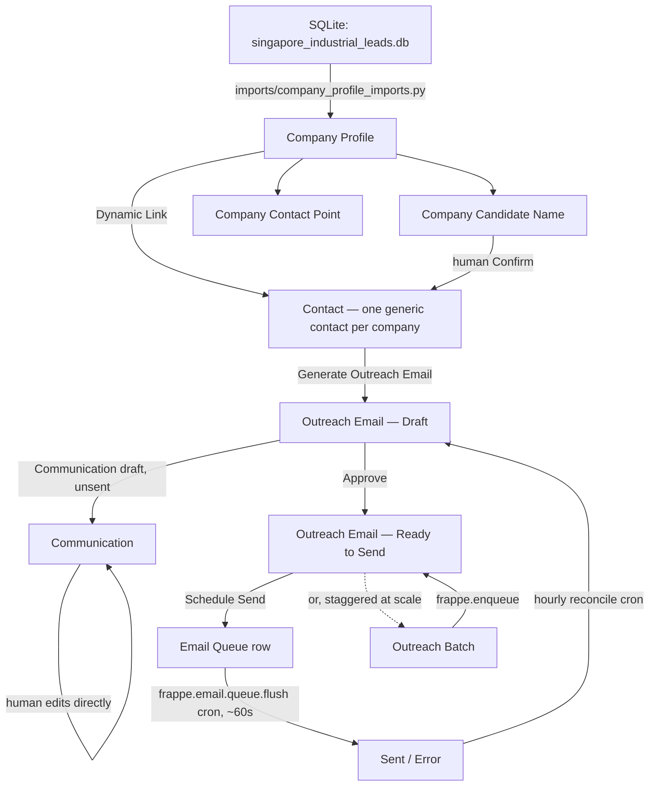

# Lead Outreach Manager

Turns verified Singapore industrial-zone leads (from the deterministic scraper pipeline at
[`lead-intelligence-pipeline`](https://github.com/phivinhkien1710-sudo/lead_intelligence)) into company
profiles, with a compliance-gated feature to generate an outreach email for a specific confirmed
contact, verify it, and schedule sending — built entirely on ERPNext's own email infrastructure.

## Architecture



## Core DocTypes

| DocType | Purpose |
|---|---|
| `Company Profile` | One record per usable lead (tier A: verified domain + found generic contact). Mirrors the source pipeline's fields; `contact_points` rebuilt wholesale each import, `candidate_names` merge-appended so confirmations survive re-import. |
| `Company Contact Point` | Child table — read-only mirror of the source `contact_points` rows. |
| `Company Candidate Name` | Child table — mirrors the source `candidate_names` rows plus the human confirmation gate (`confirmed`, `confirmed_by/_on`, linked `contact`). |
| `Outreach Email` | One record per generate→verify→schedule cycle for a single contact. |
| `Outreach Batch` | Self-imposed rate-limited/staggered scheduling across many `Outreach Email` records at once. |
| `Outreach Settings` | Singleton — defaults (email template, sender account, rate limit, business hours). |

Contact attachment uses core Frappe's own `Contact.links` (`Dynamic Link`) mechanism — the same one
Lead/Prospect/Customer already use — rather than a custom join doctype.

## Design Decisions

**Candidate names are never auto-trusted.** The source pipeline's `candidate_names` are a deliberately
unfiltered, regex-proximity-extracted bonus signal — even after an upstream cleanup pass, roughly
60-70% of them are scraped marketing copy rather than real people's names. Personalizing an outreach
email (setting a Contact's `first_name`/`last_name`/`designation`) only ever happens through an explicit
human "Confirm Name" action on a `Company Candidate Name` row — never automatically at import time.
Confirming a second name later simply re-personalizes the same Contact rather than creating a second
one, so there's never ambiguity about which of several possibly-confirmed names an email would use.

**Template-only email generation, deliberately no LLM call.** The source pipeline's whole design
philosophy is zero AI cost end-to-end; this app's email generation stays consistent with that by using
only Jinja mail-merge (`Email Template`) rendered against a Company Profile's own fields. Nothing in the
generate/approve/schedule path calls out to Claude or any other model.

**No custom mail infrastructure.** Generate → verify → schedule maps directly onto stock Frappe/ERPNext
primitives: `Communication` (an unsent draft *is* the verify step — a human edits it on its own standard
Desk form, nothing custom built for that), and `Email Queue` (`send_after` is the literal scheduling
field; the already-registered `frappe.email.queue.flush` cron, which runs every scheduler tick, sends
anything due — no new cron needed for the send-to-happen mechanic itself).

**Compliance safeguards built in from the start, not bolted on later.** Singapore's Spam Control Act /
PDPA governs unsolicited commercial email at this volume. `Company Profile.do_not_contact` and core
Contact's own `unsubscribed` field are checked at every stage (generate, approve, and again at schedule
time, since state can drift between steps) rather than only at the point of generation. `Outreach Batch`
exists specifically because Email Queue itself has no per-hour send cap — the rate limit is entirely
self-imposed, enforced by how far apart each targeted email's own `send_after` is set.

**Pipeline status fields are plain Data, not Select.** `domain_status`/`crawl_status`/`contact_status`/
`pipeline_stage` vocabularies are owned by the external Python scraper pipeline and could add new values
independently of this app. A `Select` field would silently start rejecting values the day the source
pipeline adds one; a read-only `Data` field with `search_index: 1` stays filterable without that
coupling.

**Only usable leads are imported, for now.** The importer intentionally does not import the ~57K
companies still awaiting domain/crawl processing in the source pipeline — only the tier-A "usable"
set (verified domain + a found generic contact). It's safe and idempotent to re-run
(`bench execute lead_outreach_manager.imports.company_profile_imports.import_usable_leads`) as the
source pipeline's background batch job promotes more companies to usable over time.

**Business logic lives in `services/`, not in doctype controllers.** Doctype `.py` controllers stay
thin — `validate()` hooks plus `@frappe.whitelist()` wrappers that delegate to `services/`. This keeps
the pure, DB-independent logic (contact-point preference ordering, staggered-scheduling math, Jinja
rendering) directly unit-testable without a Frappe site, and mirrors this bench's existing
`receivable_risk_manager` app's own established convention.

## Setup

```bash
cd /Users/phikien/erpnext/frappe-bench
bench --site lead-outreach.local install-app lead_outreach_manager
```

Then, on `lead-outreach.local`:
1. Configure an outgoing **Email Account** (`enable_outgoing=1`) — a real precondition, not something
   this app builds.
2. Create at least one **Email Template** for outreach content.
3. Optionally fill in **Outreach Settings** (default template, sender account, rate limit, business hours).

## Importing leads

```bash
bench execute lead_outreach_manager.imports.company_profile_imports.import_usable_leads --kwargs "{'limit': 50}"
```

Drop `limit` for a full, safe-to-repeat import of every currently-usable lead.

## Generate → verify → schedule, in short

1. (Optional) Confirm a candidate name on a `Company Profile`'s `candidate_names` grid — personalizes
   its linked Contact.
2. On that Contact's form, click **Generate Outreach Email** (only shown when eligible: has an email
   contact point, not opted out, not unsubscribed).
3. Open the linked **Communication** and edit it — that *is* the verify step.
4. **Approve**, then **Schedule Send** (single) or queue an **Outreach Batch** (staggered, rate-limited,
   for many contacts at once).

## Tests

```bash
bench --site lead-outreach.local run-tests --app lead_outreach_manager
```

Split the same way as `receivable_risk_manager`: plain `unittest.TestCase` for dependency-free logic
(`tests/test_import_helpers.py`, `tests/test_outreach_batches.py`, `tests/test_email_rendering.py`), and
`FrappeTestCase` integration tests (prefixed `TEST-LOM-...`, cleaned up in `tearDown`) for everything that
touches the database.

#### License

mit
