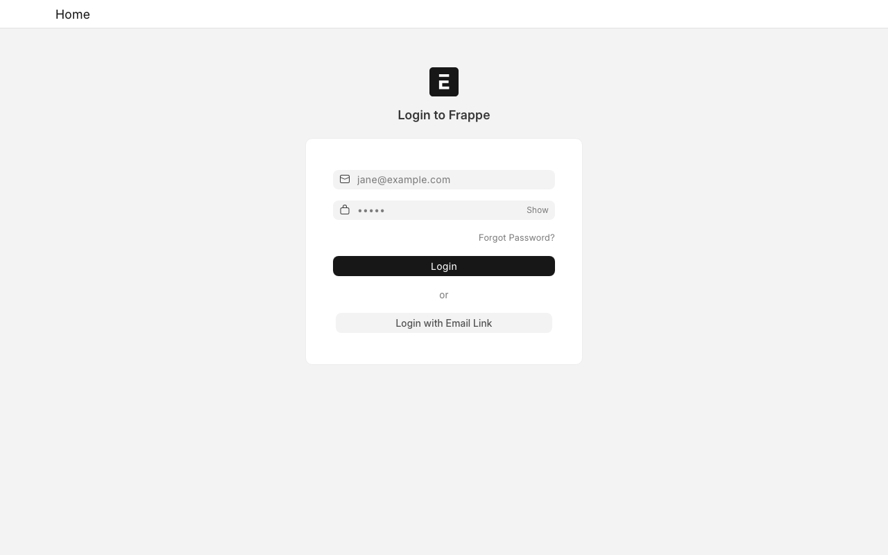
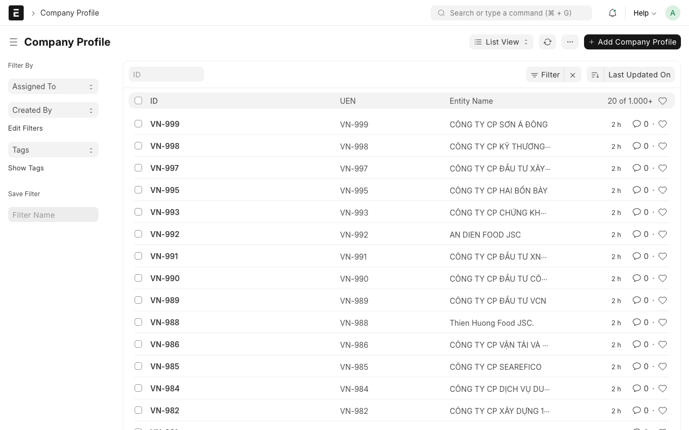
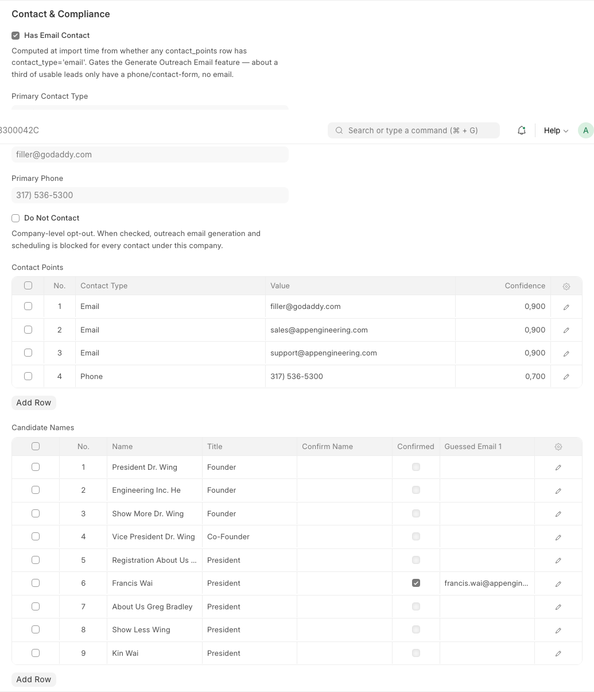
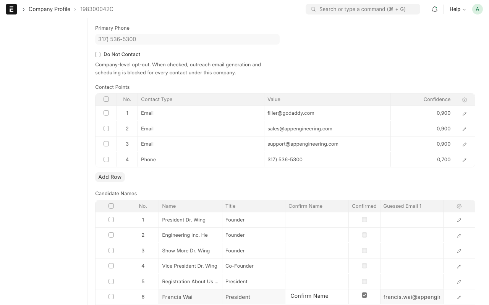
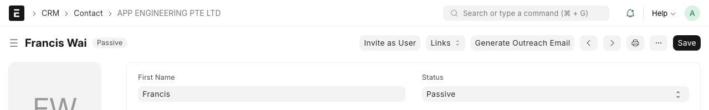
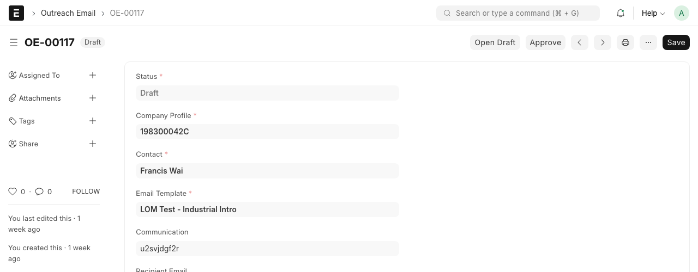
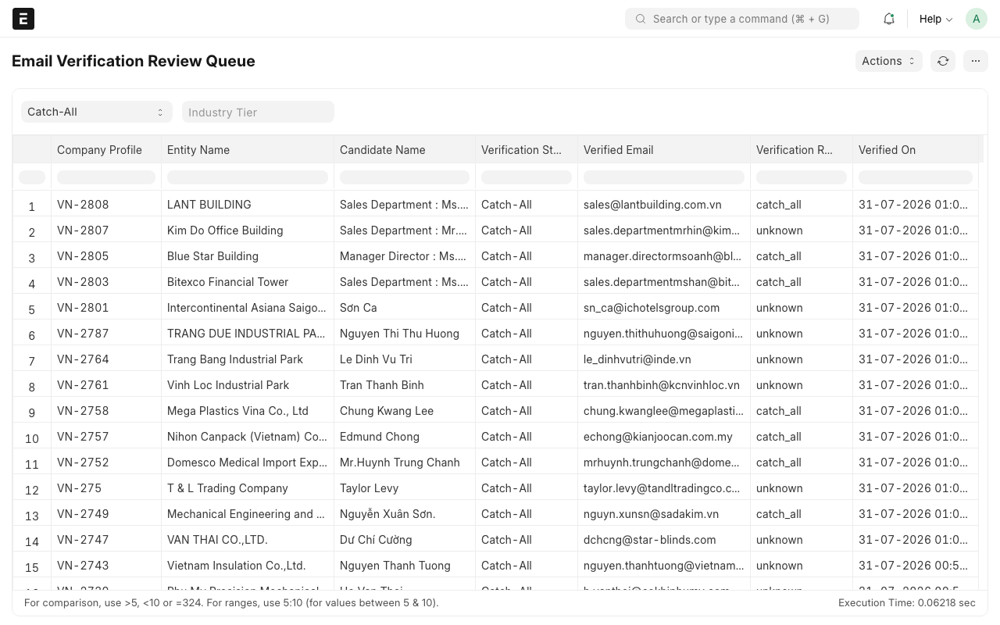

# Using the Lead Outreach Manager

This guide is for reviewing companies, confirming contacts, and approving outreach emails day to day.
No technical knowledge needed — everything here happens by clicking buttons and filling in forms.

If you're setting this app up for the first time, that's a different job for whoever's handling the
technical side — see `README.md` and `docs/DEPLOYMENT.md` instead.

## Logging in

Go to the site's web address in your browser and log in with the account you were given.

## Finding a company

Click **Company Profile** in the left-hand menu (or search for it at the top) to see the full list.
Each one is a company that's already been researched — website checked, a rough contact found. The
**Country** column shows whether it came from Singapore or Vietnam.

Click any row to open that company's full page.

## Step 1 — Confirm a real contact person

Scroll down to the **Candidate Names** section on a company's page. This is a list of names picked up
automatically from the company's website — some are real people, a lot of them aren't (page headers,
menu text, and similar noise get picked up too, since the scan isn't picky). Your job is to spot the
real one.

In the example above, most rows are obviously not people ("President Dr. Wing", "Show More Dr. Wing" —
website navigation text, not names). Row 6, "Francis Wai", is a real person — and it's already been
confirmed (the checkbox in the **Confirmed** column is ticked).

To confirm a name yourself: click into that row, and a **Confirm Name** button appears.

Clicking it does two things automatically — you don't need to do anything else:
- Attaches that name to the company's contact record
- Looks up a personal email address guess for them, so it's ready for the next step

**Only confirm a name if you're reasonably sure it's a real person.** Confirming the wrong name just
means re-confirming later — nothing is destroyed — but it wastes a step.

## Step 2 — Generate the outreach email

Once a name is confirmed, open that person's **Contact** record (click their name, or find them via
the Contact list). Near the top of the page you'll see a **Generate Outreach Email** button.

Click it. This creates a **draft** email — nothing is sent yet.

## Step 3 — Review and approve

The draft opens automatically (or find it under **Outreach Email** in the menu). Check the recipient
and subject line, then open the linked draft to read the actual message before deciding.

- **Open Draft** — read/edit the actual email content
- **Approve** — marks it ready to send

Nothing sends automatically just because a draft exists. It has to be explicitly approved, and then
scheduled, before anything goes out.

## Handling "Catch-All" and "Not Deliverable" emails

Every email address gets checked for real deliverability before it's trusted. You'll see one of three
outcomes on a candidate's row:

- **Verified** — confirmed real and deliverable. Safe to use, already wired up automatically.
- **Not Deliverable** — the address bounced or doesn't exist. Not usable.
- **Catch-All** — this is the one that needs a human. The company's mail server accepts *any* address
  thrown at it, so the check can't actually confirm whether this specific address is real — it might
  be, it might not. It's a genuine guess, not a confirmed fact.

The **Email Verification Review Queue** report lists every Catch-All row waiting on a decision:

For each one, use your judgment — does the name/domain combination look plausible? — then either
promote it (there's a "Use This Email" action on the row) or leave it for someone else to judge later.
Nothing here is time-sensitive; an unreviewed Catch-All row just sits and waits.

## What runs on its own (you don't need to do this)

- Once an email is scheduled, it sends automatically at its scheduled time.
- An hourly background check keeps each email's status (Sent / Failed) up to date — you don't need to
  refresh anything manually to see if something went through.

## If something looks wrong

If a button is missing, a page won't load, or numbers don't make sense, that's a job for whoever set
the app up technically — not something to troubleshoot yourself. Flag it to them with what page you
were on and what you expected to happen.
